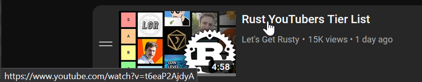

# No Query Parameters for YouTube Playlists
Very basic [Greasemonkey](https://www.greasespot.net/) script to remove extra query parameters from video links in YouTube playlists. Tested on Watch later.

Note: I'm not too well versed in DOM manipulation so contributions for cleanup are welcome